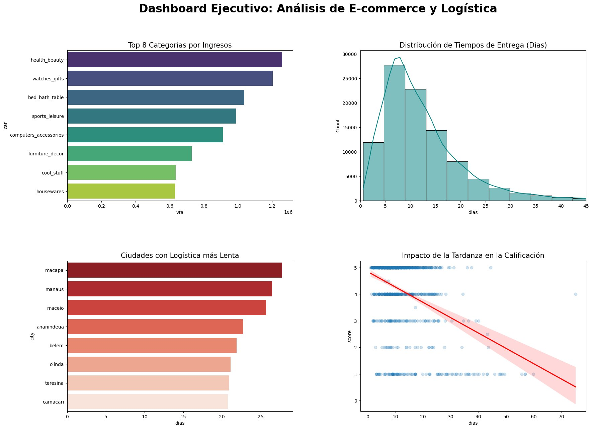
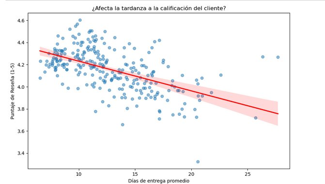

# E-commerce Logistics & Customer Satisfaction Analysis
### Data-Driven Insights for Supply Chain Optimization

## 📌 Project Overview
This project performs a comprehensive analysis of 100k+ e-commerce orders to identify the impact of logistics on business growth. As a Logistics Engineer, I developed this analysis to pinpoint regional delivery bottlenecks and their direct correlation with customer review scores.

## 🛠️ Tech Stack
* Language: Python (Pandas, NumPy)
* Database: SQLite (SQL for data modeling)
* Visualization: Seaborn, Matplotlib
* Environment: Jupyter Notebook on Linux (Lubuntu)

## 📊 Key Insights & Results

### 1. Business Dashboard
Integrated view of revenue, delivery times, and satisfaction trends.

### 2. Logistics Performance (Lead Time)
* National Median: 10.22 days.
* Critical Areas: Identified specific cities in the North and Northeast (e.g., Macapá, Manaus) where delivery times reach 28 days, doubling the national average.

### 3. Satisfaction vs. Delivery Time
Using Linear Regression, I proved a negative correlation: as delivery time increases, the probability of receiving a 5-star review drops significantly.

## 🚀 Strategic Recommendations
* Regional Distribution Centers: Implementing local hubs in high-latency zones to reduce Lead Time by 40%.
* Predictive CSAT Monitoring: Automated alerts for orders exceeding the 12-day delivery threshold to proactively manage customer expectations.

## 📂 Repository Structure
* Analisis_Logistica.ipynb: Full Python/SQL code and data processing.
* images/: High-resolution charts and dashboard.

---
*Dataset provided by Olist. Database file not included due to size.*
